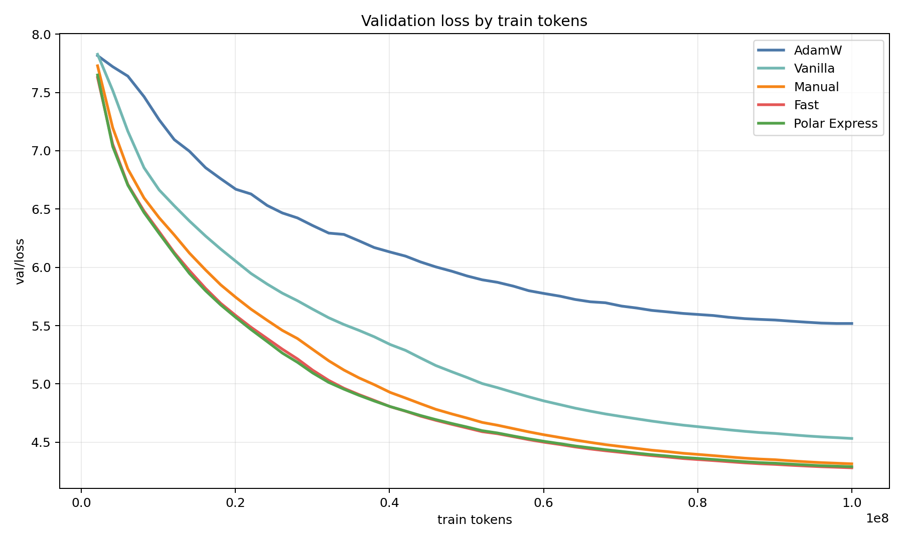
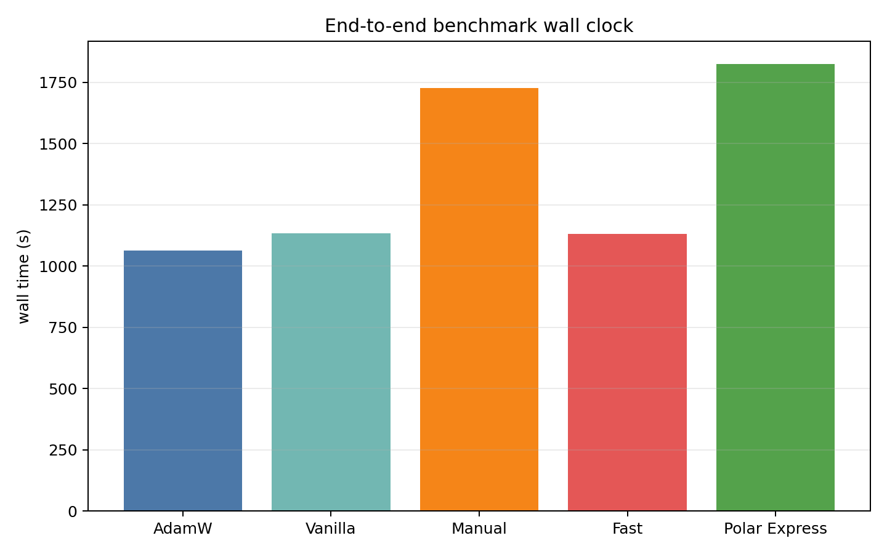
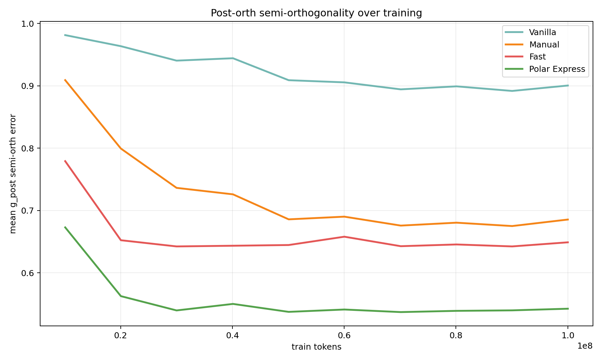
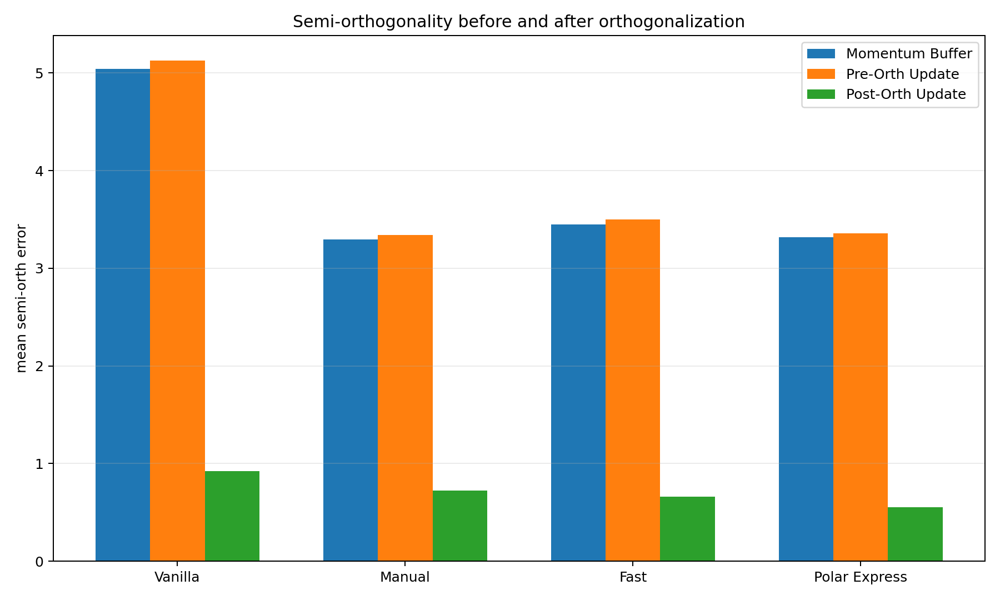
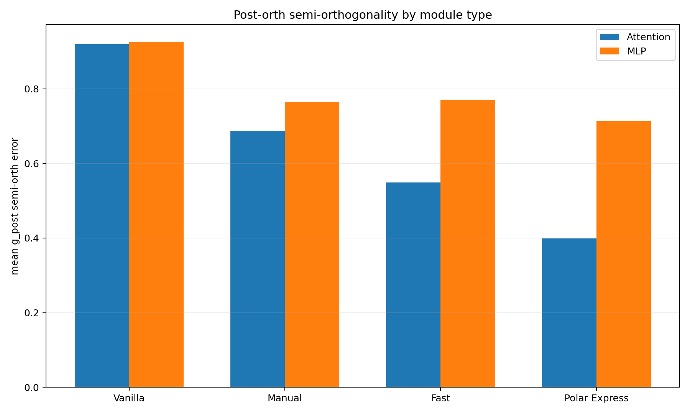

# Muon 系数调度实验结果分析

## 1. 训练结果

### 1.1 最终验证损失

| Orthogonalizer | Final Val Loss | Best Val Loss | Val-Loss AUC | Peak Memory (MiB) |
|---|---:|---:|---:|---:|
| AdamW | 5.5183 | 5.5182 | 6.1312 | 8380 |
| Vanilla | 4.5323 | 4.5323 | 5.3225 | 8074 |
| Manual | 4.3147 | 4.3147 | 5.0291 | 8074 |
| Fast | 4.2807 | 4.2807 | 4.9354 | 8074 |
| Polar Express | 4.2896 | 4.2896 | 4.9342 | 8074 |

训练结果呈现出清晰的两层结构。首先，Muon 家族整体显著优于 AdamW。AdamW 的最终验证损失为 `5.5183`，而四个 Muon 变体全部落在 `4.28` 至 `4.53` 区间，说明在当前 100M token 训练预算和固定模型规模下，矩阵参数的半正交更新对优化质量具有决定性影响。其次，Muon 内部不同系数调度之间也形成了稳定排序：`fast` 最优，`polar_express` 与其几乎并列，`manual_f3_s2` 次之，`vanilla` 最弱。

这一结果说明，在当前控制条件下，真正驱动优化效果差异的是五次迭代内部的系数安排。不同调度对应不同的奇异值映射，因此会诱导不同的更新几何。当前结果表明，`fast` 与 `polar_express` 更接近有利于优化的更新结构；`manual_f3_s2` 在此基础上保留了部分优势；`vanilla` 则相对更保守，因此在最终收敛质量上明显落后。

从数值上看，`fast` 与 `polar_express` 的最终验证损失仅相差约 `0.009`，二者处于同一性能梯队。相较之下，`vanilla` 与前三者之间的差距已经足够大，不能再视为同一水平上的微小波动。

### 1.2 阈值收敛剖面

为了更直观地比较优化效率，可以观察各方法首次达到若干固定验证损失阈值时所消耗的训练 token 数：

| Orthogonalizer | Tokens to Val Loss ≤ 7.0 | Tokens to Val Loss ≤ 6.0 | Tokens to Val Loss ≤ 5.5 |
|---|---:|---:|---:|
| AdamW | 14.02M | 48.10M | 未达到 |
| Vanilla | 8.13M | 22.02M | 36.04M |
| Manual | 6.03M | 16.12M | 26.08M |
| Fast | 6.03M | 14.02M | 22.02M |
| Polar Express | 6.03M | 14.02M | 22.02M |

这个剖面把训练曲线中的效率差异具体量化了出来。对较宽松的阈值 `7.0` 而言，四个 Muon 变体全部显著早于 AdamW，其中 `fast`、`manual` 与 `polar_express` 在约 `6.03M` token 就已达到，而 `adamw` 需要约 `14.02M` token，耗费超过两倍。`vanilla` 虽然仍优于 AdamW，但也已经开始落后于另外三种 Muon 调度。

当阈值收紧到 `6.0` 时，排序进一步分化。`fast` 与 `polar_express` 率先在约 `14.02M` token 达到该阈值，`manual_f3_s2` 稍慢，在 `16.12M` token 达到，`vanilla` 则需要 `22.02M` token，已经明显掉出第一梯队。AdamW 直到 `48.10M` token 才首次降到 `6.0` 以下，这意味着在训练中期，Muon 家族相对 AdamW 的优化效率优势已经非常显著。

对更具区分度的阈值 `5.5`，差异变得更加鲜明。`fast` 与 `polar_express` 均在 `22.02M` token 达到该水平，`manual_f3_s2` 需要 `26.08M` token，`vanilla` 则要到 `36.04M` token 才达到；AdamW 在 100M token 预算内始终未能达到 `5.5`。因此，从“达到相同验证损失需要多少 token”这一角度看，`fast` 与 `polar_express` 不仅最终点更优，而且在相当长的训练区间内都保持着最强的 token efficiency。

这一阈值分析与 `val-loss AUC` 的排序完全一致：`polar_express` 与 `fast` 最优，`manual_f3_s2` 居中，`vanilla` 较弱，AdamW 明显落后。相比仅仅比较最终验证损失，这种剖面分析进一步说明，系数调度带来的差异不是只体现在训练末尾，而是已经系统性地改变了整个收敛过程。

## 2. Benchmark 结果

### 2.1 端到端 Wall-Clock

| Orthogonalizer | Wall Clock (s) | Relative to Muon Mean | Peak Memory (MiB) |
|---|---:|---:|---:|
| AdamW | 1063.99 | -6.5% | 8380 |
| Vanilla | 1133.54 | +0.07% | 8074 |
| Manual | 1132.34 | -0.04% | 8074 |
| Fast | 1132.71 | -0.01% | 8074 |
| Polar Express | 1132.58 | -0.02% | 8074 |

benchmark 结果同样呈现出两层结构。第一层是 AdamW 与 Muon 家族之间的差异。AdamW 的总 wall-clock 为 `1063.99s`，而四个 Muon 变体全部落在 `1132.3s` 至 `1133.5s` 区间，整体快约 `68.8s`，相对差距约 `6.5%`。这说明 Muon 的额外正交化步骤确实带来了可见的系统成本。

第二层则是 Muon 内部不同调度之间的比较。在这一层上，结果几乎完全重合。四个 Muon 变体的最大时间差仅为 `1.20s`，相对 Muon 家族均值的偏差不超过 `0.07%`。因此，在当前实现和当前实验规模下，改变系数调度并不会带来可辨识的端到端 wall-clock 分化。

这一现象与实现细节完全一致。四种 Muon 调度共享同一计算图：迭代次数、张量形状和每轮执行的矩阵算子类型都完全一致，变化的只有标量系数。因此，从 GPU 执行角度看，它们的 FLOPs、kernel 数量和访存模式几乎相同，最终得到近乎一致的 wall-clock 是预期之内的结果。

AdamW 比 Muon 更快则应从两层原因理解。其一，Muon 的算法本身更重，因为每次更新都额外执行了正交化过程。其二，当前仓库中的 Muon 路径由多步 Torch 张量操作手写拼接而成，而 AdamW 更接近 PyTorch 已充分优化的标准更新路径，更可能直接受益于底层 kernel、foreach 和 fused 实现。当前 `6.5%` 的差距因此并不只是抽象算法复杂度的体现，也反映了系统实现成熟度上的差异；后者很可能是其中更重要的因素。

## 3. 谱分析结果

### 3.1 `g_post` 半正交误差

| Orthogonalizer | Mean `g_post` Semi-Orth Error | Peak Memory (MiB) |
|---|---:|---:|
| Vanilla | 0.9004 | 8863 |
| Manual | 0.6854 | 8863 |
| Fast | 0.6489 | 8863 |
| Polar Express | 0.5424 | 8863 |

谱分析结果进一步揭示了不同调度之间的几何差异。以正交化后的更新对象 `g_post` 为代表，四种 Muon 调度的半正交误差排序为

`polar_express < fast < manual < vanilla`。

**这一排序与训练结果中的验证损失排序高度一致：几何上更接近半正交的更新，通常也对应更优的最终优化表现**。特别是 `polar_express` 在谱分析中取得了最小的 `g_post` 半正交误差，而 `fast` 以很小差距位居第二；`manual_f3_s2` 明显优于 `vanilla`，但仍落后于前两者。

更重要的是，这一排序并不是仅在训练末尾出现的局部现象。上图可见，从约 `10M` token 起，四种调度的曲线便迅速拉开，并在后续训练过程中保持稳定层级关系。这表明不同系数调度诱导的谱几何差异在训练早期就已形成，并持续贯穿整个优化过程。

### 3.2 正交化前后对比

按 detail-level 数据对 `buffer_post`、`g_pre` 与 `g_post` 进行聚合，可得到如下均值：

| Orthogonalizer | `buffer_post` Error | `g_pre` Error | `g_post` Error |
|---|---:|---:|---:|
| Vanilla | 5.0407 | 5.1280 | 0.9229 |
| Manual | 3.2941 | 3.3387 | 0.7262 |
| Fast | 3.4460 | 3.4971 | 0.6598 |
| Polar Express | 3.3158 | 3.3560 | 0.5561 |

这一结果说明，谱分析管线确实捕获到了“正交化前后”的几何变化。`buffer_post` 与 `g_pre` 的半正交误差普遍仍在 `3` 至 `5` 的量级，而经过正交化之后，`g_post` 的误差会显著下降到 `0.5` 至 `0.9` 区间。由上图可见，这一下降不是个别层的偶然现象，而是所有 Muon 调度共有的结构性特征。

不过，`g_pre` 并不是一个“几乎没有差异”的对象。按全局均值看，`g_pre` 的半正交误差从 `vanilla` 的 `5.1280` 到 `manual`、`fast`、`polar_express` 的约 `3.34` 至 `3.50`，已经体现出由训练轨迹累积出来的明显分化。因此，更准确的说法是：不同调度的差异在进入正交化之前就已经存在，但正交化步骤会在这一基础上进一步压缩误差，并把 Muon 内部的几何层级拉得更清楚。

这一点在 `manual`、`fast` 与 `polar_express` 三者之间尤其明显。三者的 `g_pre` 误差都集中在 `3.34` 至 `3.50` 的狭窄区间内，但经过正交化之后，`g_post` 误差分别下降到 `0.7262`、`0.6598` 与 `0.5561`，排序被进一步拉开。换言之，调度差异既会通过长期训练动力学反映到 `g_pre` 上，也会通过正交化映射本身在 `g_post` 层面得到进一步放大和重排。

### 3.3 Attention 与 MLP 的分解

按模块类型拆分 `g_post` 半正交误差，可得：

| Orthogonalizer | Attention Error | MLP Error |
|---|---:|---:|
| Vanilla | 0.9195 | 0.9263 |
| Manual | 0.6880 | 0.7644 |
| Fast | 0.5484 | 0.7713 |
| Polar Express | 0.3994 | 0.7129 |

这一分解揭示了更细的结构差异。首先，四种调度在 attention 分支上的区分度明显强于在 MLP 分支上的区分度。`fast` 相比 `manual_f3_s2` 的优势主要体现在 attention 矩阵上，而在 MLP 矩阵上二者差距缩小。其次，`polar_express` 在两类模块上都最优，尤其是在 attention 分支上优势最为显著。由上图可以直观看到这一点。

这一结果意味着，不同系数调度对不同类型矩阵的影响并不均匀。至少在当前模型规模与采样口径下，attention 权重的谱几何似乎对调度变化更为敏感，因此也更可能成为不同调度性能分化的主要来源。

## 4. 综合结论

三组实验结果共同指向同一结论。

第一，在当前控制条件下，Muon 内部不同系数调度的主要差异体现在优化结果和谱几何上，而不体现在端到端 wall-clock 上。四种 Muon 调度在 benchmark 时间上几乎完全重合，因此当前课题的有效比较维度应是验证损失和更新几何，而不是系统吞吐。

第二，训练结果与谱分析结果具有一致的排序结构。`fast` 与 `polar_express` 给出了最优的一组验证损失；在谱几何上，`polar_express` 的半正交性最强，`fast` 次之，`manual_f3_s2` 再次，`vanilla` 最弱。这表明谱几何差异并非孤立诊断指标，而与最终优化表现存在明确对应关系。

第三，`fast` 与 `polar_express` 构成当前最有竞争力的两种调度。二者在训练结果上处于同一梯队，在 benchmark 成本上没有额外差别；差异主要体现在谱几何上，其中 `polar_express` 的正交化质量更强，而 `fast` 的最终验证损失略低。`manual_f3_s2` 可以理解为介于二者与 `vanilla` 之间的折中方案，`vanilla` 则在三类实验中均未体现出优势。

综上，当前实验支持如下判断：在当前 Muon 实现中，Newton-Schulz 系数调度首先是一个优化几何问题，而不是一个系统效率问题。对这一课题而言，最有研究价值的对象是调度如何改变更新矩阵的谱结构，以及这种谱结构变化如何进一步传导到训练收敛质量之中。
