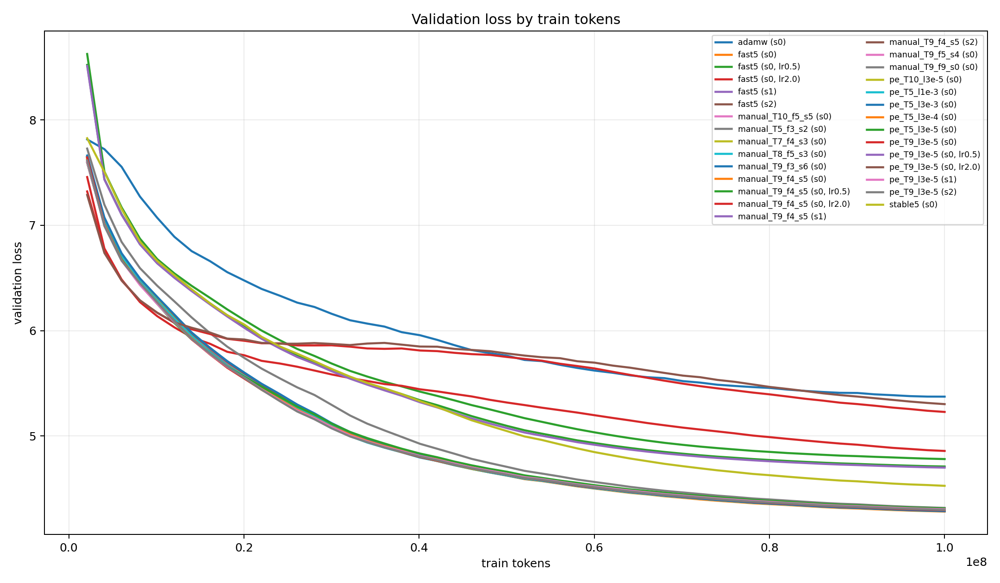
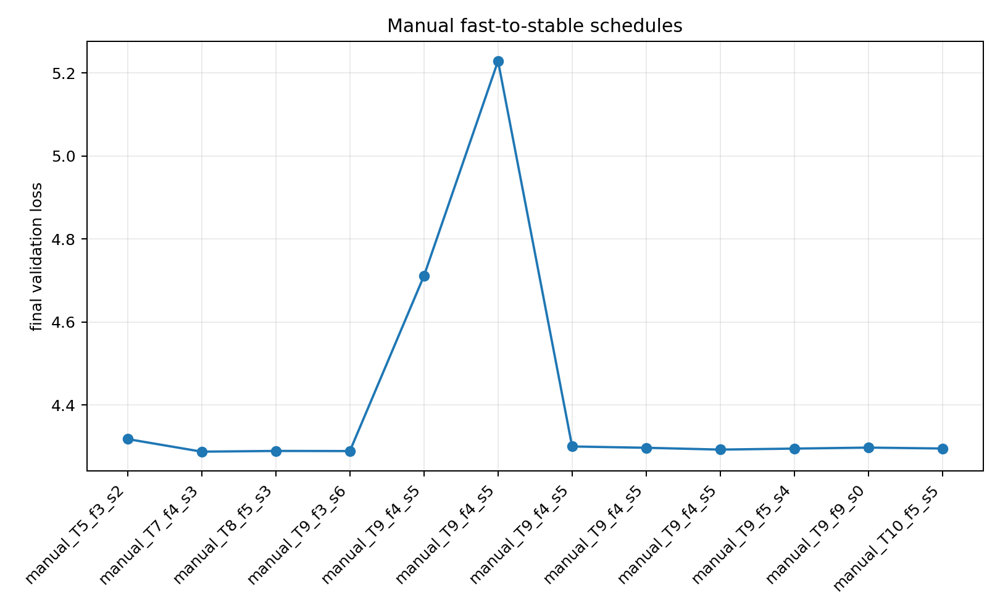
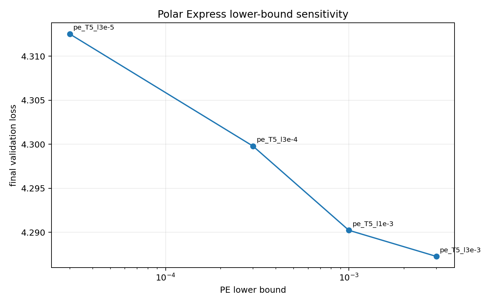
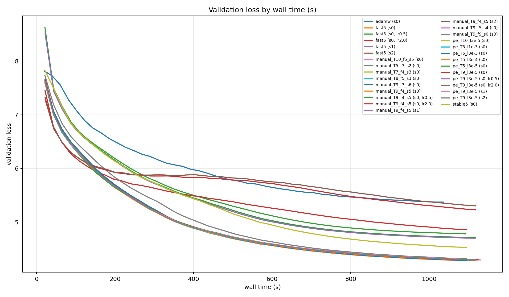
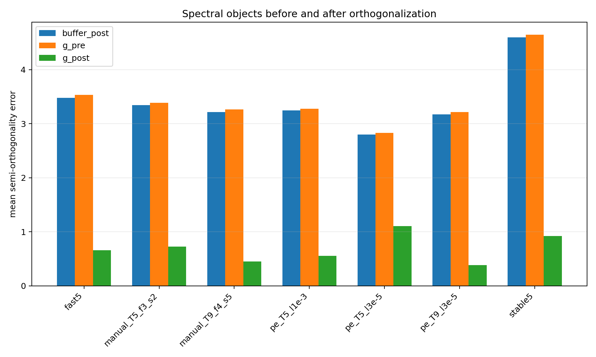
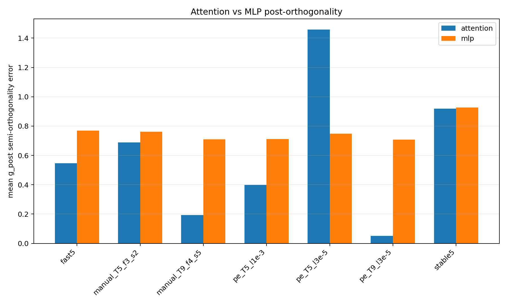
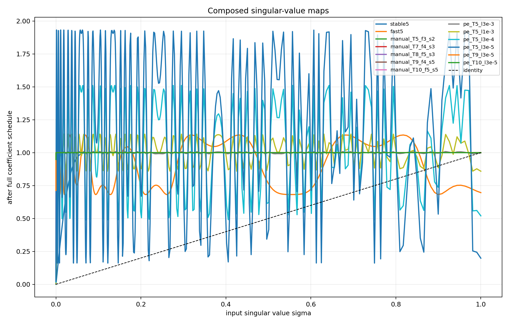

# Muon 系数调度实验结果分析

## 1. 训练结果

### 1.1 固定五步迭代下的系数序列比较

这一组实验固定模型、数据、训练 token 数、batch 设置与 learning rate schedule，只改变正交化迭代中的系数序列。为了便于阅读，下面的 `stable5` 表示连续 5 步 stable Newton-Schulz 系数，`fast5` 表示连续 5 步 fast Muon 系数，`manual_T5_f3_s2` 表示 3 步 fast 后接 2 步 stable。

| Orthogonalizer | Schedule | Final Val Loss | Best Val Loss | Val-Loss AUC | Peak Memory (MiB) |
|---|---|---:|---:|---:|---:|
| AdamW | `adamw` | 5.3737 | 5.3737 | 5.9677 | 8074 |
| Stable NS | `stable5` | 4.5273 | 4.5273 | 5.3166 | 8074 |
| Manual | `manual_T5_f3_s2` | 4.3176 | 4.3176 | 5.0295 | 8074 |
| Fast Muon | `fast5` | 4.2828 | 4.2828 | 4.9340 | 8074 |
| Polar Express | `pe_T5_l3e-3` | 4.2873 | 4.2873 | 4.9462 | 8074 |
| Polar Express | `pe_T5_l1e-3` | 4.2902 | 4.2902 | 4.9338 | 8074 |

训练结果仍然呈现出清晰的两层结构。第一层是 AdamW 与 Muon 家族之间的差异。AdamW 的最终验证损失为 `5.3737`，而 Muon 相关方法整体落在 `4.28` 至 `4.53` 区间，说明矩阵更新中的半正交化步骤对当前预训练任务有明显帮助。

第二层是 Muon 家族内部的系数差异。`stable5` 明显落后于其他 Muon 调度，`manual_T5_f3_s2` 处在中间位置，`fast5` 与较好的 Polar Express 配置位于第一梯队。这个结果与最初的单 seed 实验一致，也说明五步迭代内部的系数安排已经足以改变训练曲线，而不只是改变最终几个点的数值。

### 1.2 多 seed 确认

为了检查代表性配置之间的差距是否稳定，我们对 `fast5`、`manual_T9_f4_s5` 和 `pe_T9_l3e-5` 进行了 seeds 0/1/2 的重复实验。

| Schedule | Seed 0 | Seed 1 | Seed 2 | Mean Final Val Loss | Std |
|---|---:|---:|---:|---:|---:|
| `fast5` | 4.2828 | 4.2921 | 4.2928 | 4.2892 | 0.0046 |
| `manual_T9_f4_s5` | 4.2923 | 4.2998 | 4.2966 | 4.2962 | 0.0031 |
| `pe_T9_l3e-5` | 4.2961 | 4.3047 | 4.2987 | 4.2998 | 0.0036 |

这一结果使主结论更加稳健。在当前 100M token 预算下，`fast5` 在三个 seed 上都低于另外两个代表配置，平均 final validation loss 也最低。`manual_T9_f4_s5` 与 `pe_T9_l3e-5` 的差距并不大，但它们没有在这个训练尺度上转化为更低的验证损失。因此，`fast5` 是当前实验中最强的 practical baseline。

### 1.3 Manual 迭代步数趋势

下面的实验用于观察 manual fast-to-stable family 在增加迭代步数后是否有稳定收益。这里的代表点同时改变了总步数和 fast/stable split，因此按 family 内部趋势来解读。

| Schedule | Final Val Loss | Val-Loss AUC |
|---|---:|---:|
| `manual_T5_f3_s2` | 4.3176 | 5.0295 |
| `manual_T7_f4_s3` | 4.2873 | 4.9312 |
| `manual_T8_f5_s3` | 4.2890 | 4.9253 |
| `manual_T9_f3_s6` | 4.2887 | 4.9271 |
| `manual_T9_f4_s5` | 4.2923 | 4.9268 |
| `manual_T10_f5_s5` | 4.2949 | 4.9282 |

从 T=5 到 T=7/8/9/10，manual schedule 的验证损失明显改善，并迅速接近 `fast5`。不过，继续增加迭代步数并没有形成单调下降的趋势。T=7、T=8、T=9 和 T=10 的结果都处在很窄的区间内，说明额外迭代确实改变了更新几何，但训练目标并没有持续奖励更深的 manual 正交化。

### 1.4 Polar Express lower bound

Polar Express 的 lower bound 决定了构造多项式时假设的奇异值区间。为了单独观察这一参数的影响，下面固定 PE 迭代步数为 5，只改变 lower bound。

| Schedule | Final Val Loss | Val-Loss AUC |
|---|---:|---:|
| `pe_T5_l3e-3` | 4.2873 | 4.9462 |
| `pe_T5_l1e-3` | 4.2902 | 4.9338 |
| `pe_T5_l3e-4` | 4.2998 | 4.9349 |
| `pe_T5_l3e-5` | 4.3125 | 4.9479 |

结果显示，lower bound 的选择会直接影响最终验证损失。较小的 lower bound 会显著改变小奇异值区域的放大行为，但这种更强的谱变换并没有在 T=5 下稳定带来更低 loss。这个现象说明，Polar Express 的 lower bound 是一个具有明确数学含义的算法参数。

## 2. Benchmark 结果

### 2.1 端到端 Wall-Clock

| Schedule | Wall Clock (s) | Peak Memory (MiB) |
|---|---:|---:|
| `adamw` | 1039.73 | 8074 |
| `stable5` | 1094.87 | 8074 |
| `fast5` | 1095.10 | 8074 |
| `manual_T5_f3_s2` | 1099.42 | 8074 |
| `manual_T9_f4_s5` | 1123.53 | 8074 |
| `pe_T5_l3e-5` | 1098.12 | 8074 |
| `pe_T9_l3e-5` | 1119.42 | 8074 |

benchmark 结果与算法结构一致。AdamW 不执行矩阵正交化，因此 wall-clock 最低。T=5 的 Muon 变体耗时非常接近，说明在相同步数和相同矩阵算子结构下，改变标量系数几乎不会改变端到端运行时间。

更长的 T=9 manual 与 T=9 Polar Express 会带来额外开销，wall-clock 分别上升到 `1123.53s` 和 `1119.42s`。因此，T 增大或正交化更精细时，应同时观察 validation loss、wall-clock 和谱误差。当前代码中 AdamW 与 Muon 路径都使用手写 Torch 张量操作，这里的 wall-clock 差异主要来自是否执行正交化以及迭代步数差异。

## 3. 谱分析结果

### 3.1 正交化前后对比

谱分析记录了三个对象。`buffer_post` 是 momentum buffer 更新后的矩阵，`g_pre` 是进入正交化前的 Nesterov mixed matrix，`g_post` 是正交化后的 update matrix。

| Schedule | `buffer_post` Error | `g_pre` Error | `g_post` Error |
|---|---:|---:|---:|
| `stable5` | 3.0746 | 3.1320 | 0.9006 |
| `fast5` | 3.4377 | 3.4914 | 0.6444 |
| `manual_T5_f3_s2` | 3.1098 | 3.1755 | 0.6866 |
| `manual_T9_f4_s5` | 3.7297 | 3.7885 | 0.4431 |
| `pe_T5_l1e-3` | 4.0631 | 4.1326 | 0.5452 |
| `pe_T9_l3e-5` | 3.8317 | 3.9036 | 0.3781 |

这一结果说明，所有 Muon 调度都会显著降低正交化后的误差，但降低幅度不同。`manual_T9_f4_s5` 和 `pe_T9_l3e-5` 的 `g_post` 误差明显低于 `fast5`，说明更长的 mixed schedule 和更深的 PE 确实生成了几何上更接近半正交的更新。

有意思的是，这种更强的几何效果没有同步转化为更低的 validation loss。多 seed 结果中，`fast5` 的 final loss 仍然最低。这是当前实验中最值得讨论的现象：正交化质量是影响训练的重要变量，但它和语言建模 loss 之间呈现出更复杂的关系。

### 3.2 Attention 与 MLP 的分解

按模块类型拆分 `g_post` 半正交误差，可得：

| Schedule | Attention Error | MLP Error |
|---|---:|---:|
| `fast5` | 0.5146 | 0.7743 |
| `manual_T9_f4_s5` | 0.1776 | 0.7086 |
| `pe_T9_l3e-5` | 0.0481 | 0.7081 |

分解结果显示，schedule 之间的几何差异主要集中在 attention projection matrices 上。`pe_T9_l3e-5` 在 attention 上的误差最低，`manual_T9_f4_s5` 次之，二者都明显低于 `fast5`。MLP 部分的差距则小得多。这个结构性差异说明，不同正交化映射对模型内部不同矩阵类型的影响并不均匀，attention 权重可能是更敏感的观察窗口。

## 4. 奇异值映射分析

Newton-Schulz-style 正交化可以从奇异值映射角度理解。对奇异值 \(\sigma\)，单步映射近似为：

\[
p(\sigma)=a\sigma+b\sigma^3+c\sigma^5.
\]

完整 schedule 对应复合映射 \(p_T(\sigma)\)。为了刻画小奇异值被放大的程度，可以看

\[
\mathrm{gain}(\sigma)=\frac{p_T(\sigma)}{\sigma}.
\]

在 \(\sigma=10^{-5}\) 时，不同 schedule 的 gain 为：

| Schedule | Gain |
|---|---:|
| `stable5` | 32 |
| `fast5` | 485 |
| `manual_T9_f4_s5` | 4502 |
| `pe_T9_l3e-5` | 71309 |

这个分析给训练结果提供了一个更直接的数学解释。`stable5` 对小奇异值的放大较弱，因此更新更保守；`fast5` 放大更强，早期优化效果明显更好；更长的 manual 与 PE schedule 会进一步强化小奇异值区域的映射，但这种更强的谱校正并没有自动带来更低 validation loss。也就是说，谱映射的强度需要与训练动力学共同考虑。

## 5. 综合结论

这些实验把最初的单 seed 观察补成了更清晰的控制变量图景。

首先，固定 T=5 时，系数序列本身已经足以造成明显差异。`stable5` 明显落后，`manual_T5_f3_s2` 居中，`fast5` 与较好的 Polar Express 配置处于第一梯队。这说明 Muon 中的 fast coefficients 在当前预训练尺度下是非常有效的谱映射。

其次，更深或更精细的正交化确实改变了 update geometry。`manual_T9_f4_s5` 与 `pe_T9_l3e-5` 都显著降低了 `g_post` 半正交误差，尤其在 attention projection matrices 上差异很大。然而，多 seed 训练结果显示，几何上更接近半正交并没有在当前 100M token 预算下超过 `fast5` 的 validation loss。

第三，Polar Express 的 lower bound 与 iteration depth 都是有明确数学含义的参数。它们改变复合奇异值映射 \(p_T(\sigma)\)，也会改变训练曲线和谱诊断结果。更合适的表述是：PE 提供了一种更可解释的谱映射族，但它在当前设置下还没有表现出相对 `fast5` 的 loss 优势。

因此，当前最稳妥的结论是：`fast5` 是本实验设置下最强的 practical baseline；manual 和 Polar Express 的主要价值在于提供了可控的谱几何变化，帮助我们研究正交化程度、奇异值映射和训练效果之间的关系。
